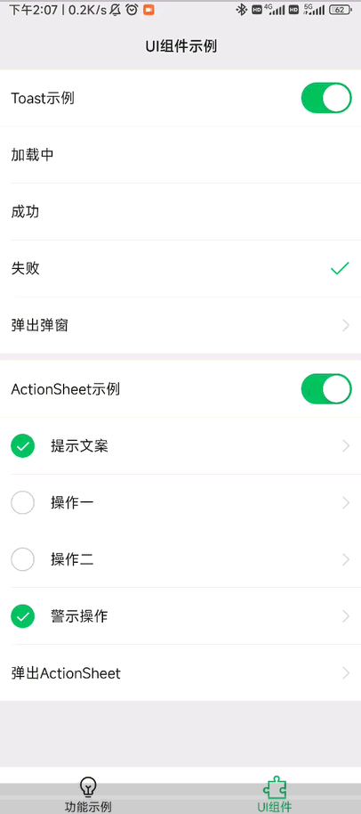
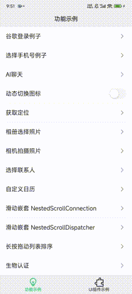
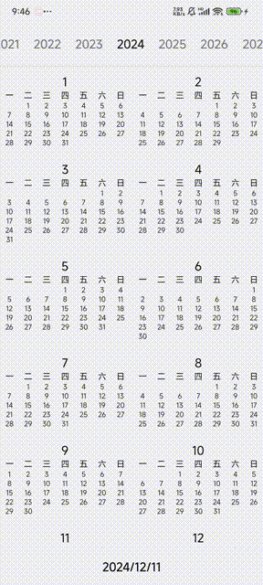
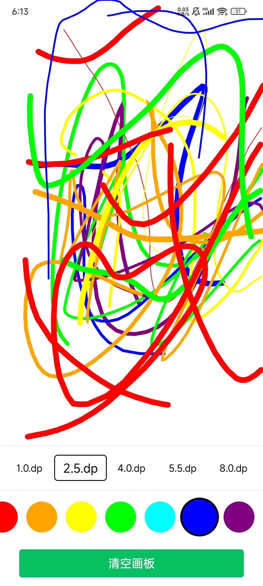
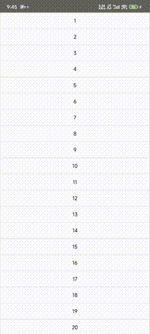
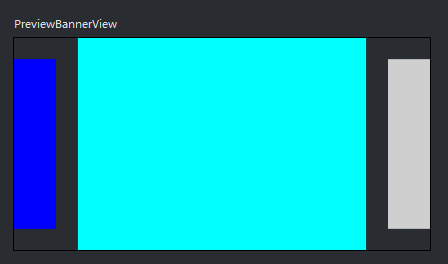

# Quickly-Use-Jetpack-Compose

这是一个立足于 **商业级开发标准** 的个人 Jetpack Compose 实战型工程模板，我会持续维护并同步最新的实战沉淀。项目深度集成 **多模块插件化管理**、**自定义设计系统**、**离线可用数据仓库**及**启动性能优化**等现代化工程化标准；同时涵盖了**系统能力深度封装**、**三方 SDK 集成示例**及**交互体验优化**等实战方案。旨在为开发者提供一套标准化、可复用的工程底座，跳过基础设施搭建，直接进入高质量业务开发。

# 📜 协议

[查看隐私协议](PRIVACY.md)

# 🏗️ 架构

Quickly-Use-Jetpack-Compose 的架构参考 Android 官方最佳实践项目 [Now in Android App](https://github.com/android/nowinandroid)。

## 架构组件

+ **模块化**：按 app、core、feature、flavor、res 等模块组织代码，降低耦合。
+ **依赖注入**：使用 Hilt 管理全局和局部依赖。
+ **数据层**：采用 Repository 模式，集成 **Room** 数据库和 **Ktor (OkHttp)** 网络请求。
+ **UI 驱动**：单 Activity 架构，使用 Navigation 管理页面跳转，结合 Compose + ViewModel + Flow 实现响应式 UI。

## 体验优化

+ **任务栈调度**：内置 `SchemeActivity` 中转层，解决外部回跳（如支付回调、OAuth 登录）时的任务栈错乱问题，确保应用无缝恢复至离开前的状态。
+ **最近任务清理**：封装 `finishAndCleanupTask` 扩展函数，针对独立任务栈（如 WebView）提供自动销毁机制，确保 Activity 退出后及时清理“最近任务列表”中的空白残留。
+ **视频边播边存**：基于 Media3 封装 LRU 缓存机制，实现视频数据在播放时本地同步持久化，实现二次打开秒开并显著节省流量消耗。
+ **图片磁盘缓存**：深度配置 Coil 磁盘缓存策略，确保网络图片在离线状态下依然可见，并大幅提升图片重载速度与滚动流畅度。

# 🎨 设计系统

项目包含一套自定义 Compose 设计系统，偏微信风格，不直接套用 Material 3 的视觉样式。

+ **WeTheme**：替代 MaterialTheme，竖屏按 375dp 设计宽度适配。
+ **WeColorScheme**：定义颜色体系，支持系统、动态、浅色、深色和蓝色主题。
+ **WeTypography**：定义字体大小体系。
+ **WeIndication**：定义触摸、悬停和焦点反馈。
+ **WeDimen**：定义尺寸规范。
+ **WeIcons**：使用 ImageVector 绘制图标。
+ **WeWidget**：顶部栏、底部栏、Button、Toast、ActionSheet、单选、多选、开关等通用组件。
+ **View**：Banner (BannerView)、可点击富文本 (ClickableAnnotatedText)、拖拽排序 (DragList)、错误页 (ErrorView)、Loading、禁止截屏 (SecureComposeView) 等常用 Compose 组件。

# 📦 Module 目录简介

+ **app**：应用入口，汇总各 feature 并统一处理 Navigation。
+ **build-logic**：自定义 Gradle Convention 插件，统一管理 Compose、Hilt、Serialization、Library、Application 等构建配置。
+ **core-logic**：
    - `common`：日志、Toast、协程调度、缓存等基础工具。
    - `database`：基于 **Room** 的持久化存储。
    - `network`：基于 **Ktor** 的网络请求封装。
    - `repository`：业务数据层，包含聊天 (Google AI Chat)、用户信息、产品等仓库。
    - `authenticate`：Google 登录、生物认证逻辑封装。
    - `notification`：通知管理，包含 Firebase Cloud Messaging。
    - `location`：定位能力封装。
    - `language`：多语言切换逻辑。
+ **core-ui**：设计系统核心实现和通用 UI 组件库。
+ **core-launcher**：封装 `ActivityResultLauncher`，提供一行代码调用相册、相机、联系人、手机号选择及权限申请的能力。
+ **feature**：
    - `main`：应用主框架，包含首页 Pager 容器。
    - `samples`：UI 交互示例，包含 **自定义日历**、**绘画画板**、**嵌套滚动** 等。
    - `settings`：应用偏好设置（多语言、字体大小、主题切换）。
    - `integrations`：网络与系统能力集成示例（HTTP、Firebase、生物认证）。
    - `chat`：基于 **Google AI Gemini** 的智能聊天示例。
    - `video`：基于 **Media3** 的视频播放器。
    - `webview`：通用的 WebView 容器。
+ **flavor**：提供 `gp` (Google Play) 和 `sam` (Samsung) 渠道差异化实现示例。
+ **res**：统一管理字符串、图片、多语言等资源文件。
+ **baseline-profile**：配置启动性能优化。

# 🚀 开发与运行

建议使用最新版本 Android Studio 打开项目。运行时切换到 `app` 配置后启动。

## 密钥与签名

密钥文件存放在根目录的 `keystore` 目录中。签名相关配置在 `AndroidApplicationConventionPlugin.kt`。

## 构建变体 (Build Variants)

项目预设了 `gp` 和 `sam` 两个 productFlavors，分别对应不同的 ApplicationId 和签名配置，可在 Android Studio 的 Build Variants 面板中切换。

# 📱 运行效果

### 核心业务能力

| 示例 | 截图/GIF | 亮点 |
| --- | --- | --- |
| **WeWidget 组件库** |  | 纯手工打造的微信风格组件库，脱离 Material 限制 |
| **AI 聊天 (Gemini)** |  | 集成 Google AI Gemini，展示流式响应与通知集成 |
| **Media3 视频播放** |  | 封装 Media3，支持边播边存与离线缓存，处理 Lifecycle 与全屏切换 |

---

### 系统能力集成

| 示例 | 截图/GIF | 亮点 |
| --- | --- | --- |
| **系统能力合集** |  | 封装权限申请、定位、相册、联系人选择 |
| **动态切换图标** |  | 无需发版，动态更换 App 桌面入口图标 |
| **网络异常处理** |  | 统一的错误码拦截、Loading 与 Retry 机制 |

---

### UI 交互与多语言

| 示例 | 截图/GIF |
| --- | --- |
| **自定义日历** |  |
| **绘画画板** |  |
| **多语言与主题** |  |
| **Lazy 列表排序** |  |
| **Banner 轮播** |  |
