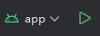

# Quickly-Use-Jetpack-Compose

一个用于快速学习和复用 Jetpack Compose 实践的示例项目。项目以 Compose、Hilt、Navigation、ViewModel、Flow 和模块化工程为基础，尽量把常见移动端能力整理成可运行的示例。

# 协议

[查看隐私协议](PRIVACY.md)

# 架构

Quickly-Use-Jetpack-Compose 的架构参考 Android 官方最佳实践项目 [Now in Android App](https://github.com/android/nowinandroid)。也可以查看 [DeepWiki](https://deepwiki.com/Cheng-Kun-Liu/Quickly-Use-Jetpack-Compose)。

## 架构组件

+ 模块化：按 app、core、feature、flavor、res 等模块组织代码。
+ 依赖注入：使用 Hilt 管理依赖。
+ 单 Activity：主流程使用 Navigation 管理页面跳转。
+ Compose + ViewModel + Flow：用响应式状态驱动 UI。

# 设计系统

项目包含一套自定义 Compose 设计系统，偏微信风格，不直接套用 Material 3 的视觉样式。

+ WeTheme：替代 MaterialTheme，竖屏按 375dp 设计宽度适配。
+ WeColorScheme：定义颜色体系，支持系统、动态、浅色、深色和蓝色主题。
+ WeTypography：定义字体大小体系。
+ WeIndication：定义触摸、悬停和焦点反馈。
+ WeDimen：定义尺寸。
+ WeIcons：使用 ImageVector 绘制图标。
+ WeWidget：顶部栏、底部栏、Button、Toast、ActionSheet、单选、多选、开关等通用组件。
+ View：Banner、可点击富文本、拖拽排序、错误页、Loading 等常用 Compose 组件。

# Module 目录简介

+ app：应用入口，汇总各 feature 并统一处理 Navigation。
+ build-logic：自定义 Gradle 插件和通用构建配置。
+ core-logic：数据库、网络、认证、通知、定位、语言等业务能力。
+ core-ui：设计系统和通用 UI 组件。
+ core-launcher：相册、相机、联系人、手机号、权限等系统能力封装。
+ feature：按业务逻辑分组的功能模块。
    - main：应用主框架，包含 Pager 容器、底部导航及悬浮窗示例。
    - samples：UI 交互与自定义组件示例（日历、画板、嵌套滚动）。
    - settings：应用偏好设置（多语言、字体大小、主题切换）。
    - integrations：网络与系统能力集成（HTTP、Firebase、生物认证）。
    - chat：基于 Google AI Gemini 的聊天示例。
    - video：基于 Media3 的视频播放器示例。
    - webview：通用的 WebView 容器实现。
+ flavor：不同渠道包的差异代码。
+ res：统一管理字符串、图片等资源。
+ baseline-profile：启动性能相关的 Baseline Profile 配置。

# 当前示例入口

主界面按三个页签组织示例：

## Features

+ 核心功能：Firebase、Ktor HTTP、AI Chat、WebView。
+ 认证：Google 登录、生物认证。
+ 设备与系统能力：动态图标、定位、选择手机号、相册选图、相机拍照、选择联系人。

## UI

+ Banner 展示。
+ 长按拖拽排序。
+ 嵌套滚动：NestedScrollConnection 和 NestedScrollDispatcher。
+ 自定义日历。
+ 绘画画板。

## Settings

+ 多语言切换。
+ 主题切换。
+ 字体大小切换。

# 已实现但未接入主示例入口

+ 视频播放：`feature:video` 已实现 Media3 播放页和 `VideoPlayActivity`，当前未在主界面提供入口。

# 开发与运行

建议使用最新版本 Android Studio 打开项目。运行时切换到 `app` 配置后启动。

## 密钥

密钥文件存放在根目录的 `keystore` 目录中。签名相关配置在 `ApplicationConventionPlugin.kt`。

## 打包

+ `bundleRelease`：打包 AAB。
+ `assembleRelease`：打包 APK。
+ 项目使用 productFlavors，可以在 Build Variant 中选择不同渠道。

# 运行效果

| 示例 | 截图 |
| --- | --- |
| 绘画画板 |  |
| 多语言 |  |
| Lazy 列表排序 |  |
| 自定义日历 |  |
| 动态切换图标 |  |
| AI 聊天和通知 |  |
| 网络异常处理 |  |
| Banner |  |
| 定位、图片、联系人 |  |
